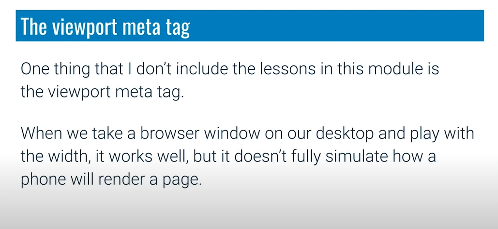

# Responsive-Web-Design

* 1em = match the font size of the family (100 %)
* 1.5 em = 150% of parent 

eg. 1.5 * 1.5 * 1.5 massive issue
* So the solution for this is `rems`

* Apart from font size(relative to parent) , em is relative to own element's font size(padding,margin)

* The above problem is solved by give the value of the padding of the button in `em`

## Responsive Layout Basics

* Try to put image as `max-width:100%;`
* Compound selector - A compound selector in CSS is used to combine multiple selectors to apply specific styles to elements that match all the criteria of the combined selectors. It allows you to target elements based on more than one condition, making your styling more precise and targeted.
## Media query

* Atleast 400px need to be there

* Always orders matters

* The above never get orange
* After flex-direction : column

* We are going to do this

* All Device Layout [click here](https://xd.adobe.com/spec/75d448ea-569a-4b7e-721b-9bbd3b2b97b9-03e5/grid/)
* Bold vs bolder
    * bold -> 300 to 700
    * bolder -> 300 to 400
* In media Start to think for mobie 
* So first remove the mdia query and add them in normal class

